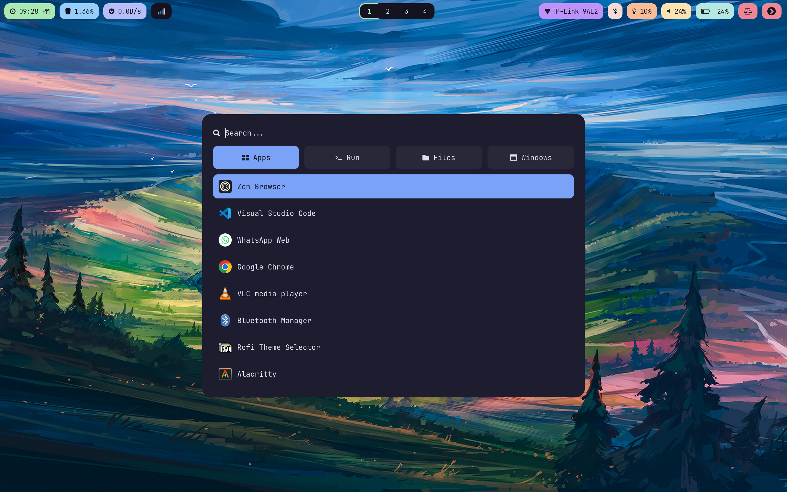

# Hyprland Dotfiles

This repository contains my personal dotfiles for Hyprland

## 📜 Dependencies
Make sure to install the following dependencies before using these dotfiles:

- **Hyprland** - Window manager
- **Hyprlock** - lockscreen
- **Hypridle** - Idle daemon
- **Waybar** - Status bar
- **Rofi** - Application launcher
- **Dunst** - Notification daemon
- **Nautilus** - File manager
- **Alacritty** - Terminal emulator
- **Fish Shell** - Alternative shell
- **PyWal16** - Theming
- **Micro Editor** - Text editor
- **SWWW** - Wallpaper management

## 🎨 Theming
- Uses **PyWal** for dynamic color theming.
- Waybar and Rofi follow the selected colorscheme.
- Fonts: **JetBrains Mono Nerd Font**

## 🤝 Contributing
Feel free to fork and modify these dotfiles to suit your needs. PRs are welcome!

## 📝 License
This project is licensed under the MIT License.
